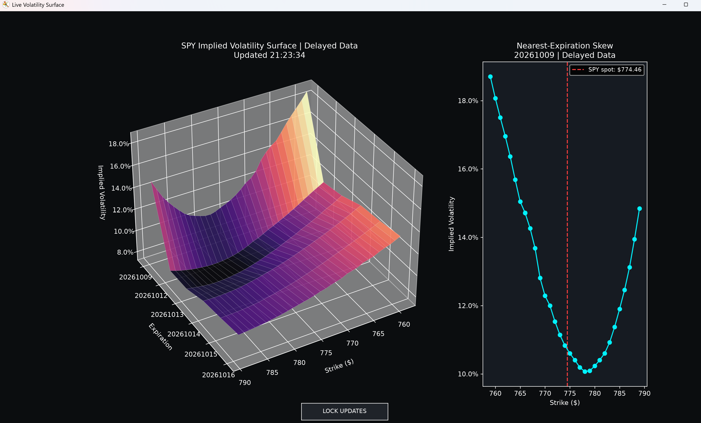

# SPY Implied Volatility Surface Dashboard

A Python desktop dashboard that visualizes SPY option implied volatility across strikes and expirations using the Interactive Brokers TWS API.

## Dashboard Preview



*Screenshot captured using delayed market data.*

## Features

- Interactive 3D implied volatility surface.
- Nearest-expiration volatility skew with a SPY spot-price marker.
- Selection of up to six upcoming expirations and strikes within ±2% of the initial underlying price.
- Support for live and delayed model IV callbacks.
- Lock/unlock control to pause chart updates while inspecting the surface.
- Background thread for Interactive Brokers API communication.

## How It Works

The application resolves the underlying contract, selects the regular SPY option chain, and requests individual option market data.

It collects Interactive Brokers model implied volatility, organizes observations by strike and expiration, and renders a surface alongside the nearest-expiration curve. The application uses IB-provided IV rather than calculating IV from option prices itself.

Missing grid values are interpolated along the expiration rows and then backward/forward filled for visualization. Some plotted values therefore represent filled estimates rather than independently received observations.

## Setup

1. Install Python and the dependencies:

   ```bash
   python -m pip install -r requirements.txt
   ```

2. Install the official Interactive Brokers Python TWS API package (`ibapi`) compatible with your TWS/API version.

3. Open Trader Workstation or IB Gateway and enable socket API connections.

4. Check the connection settings in `start_app()`:

   ```python
   app.connect('127.0.0.1', 7497, 35)
   ```

   The configured port must match your TWS or Gateway settings.

5. Run:

   ```bash
   python volsuface.py
   ```

Allow the option requests to finish and IV observations to arrive before expecting a surface.

## Controls

- Drag the 3D chart to rotate the surface.
- Click **LOCK UPDATES** to freeze chart refreshes.
- Click **UNLOCK UPDATES** to resume refreshes.

## Data and Limitations

- Market data availability depends on account permissions and subscriptions.
- The current configuration requests delayed data; IB may return live data when permitted.
- Chart titles currently say “Delayed Data” and do not automatically detect the returned feed type.
- The latest received underlying price may be a last trade or closing price.
- The expiration axis uses equally spaced rows rather than actual time-to-expiration.
- The surface is a visualization, with no arbitrage-free calibration or quote-quality validation.
- Locking updates pauses plotting; API data collection continues.

## Technology

Python, Interactive Brokers TWS API, pandas, NumPy, and Matplotlib.
